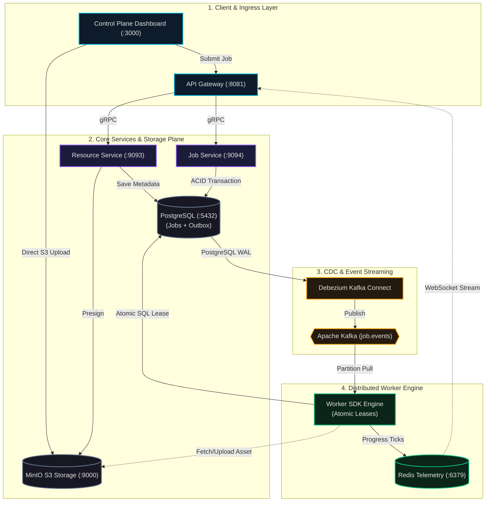
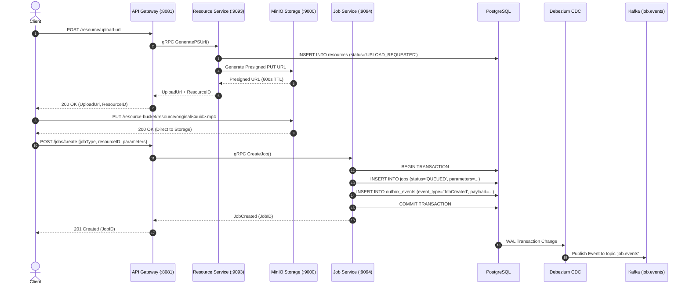
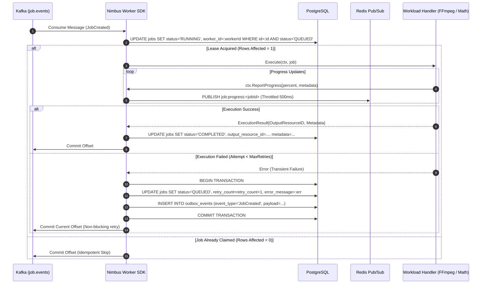
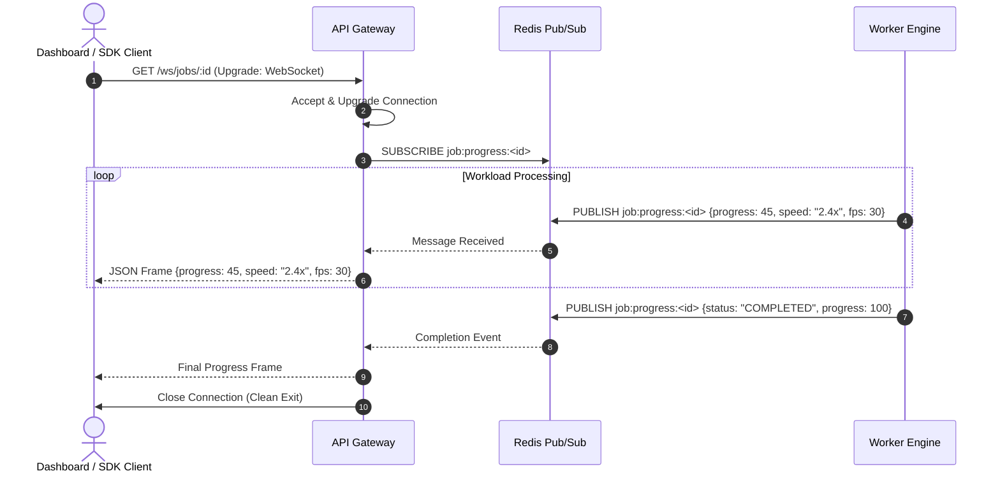

# Nimbus ⚡
### Cloud-Native Distributed Job Execution Engine & Control Plane

[](https://golang.org)
[](https://react.dev)
[](https://vitejs.dev)
[](https://tailwindcss.com)
[](https://kafka.apache.org)
[](https://www.postgresql.org)
[](https://redis.io)
[](https://min.io)
[](https://kubernetes.io)

**Nimbus** is a cloud-native, distributed job execution engine designed for high-throughput, crash-resilient asynchronous workload processing. It decouples high-volume job ingestion from heavy distributed compute using the **Transactional Outbox Pattern**, **Debezium Change Data Capture (CDC)**, **Kafka message partitioning**, and **distributed atomic conditional SQL leases**.

Nimbus ships with an extensible **Worker SDK (`pkg/nimbus`)** that enables developers to build custom asynchronous workloads (media transcoding, AI model inference, document conversion, ETL pipelines) with automatic panic recovery, live progress streaming, and zero-downtime distributed retries.

---

## 📑 Table of Contents
1. [Core Architectural Highlights](#-core-architectural-highlights)
2. [System Architecture](#-system-architecture)
3. [Component Matrix](#-component-matrix)
4. [Sequence Diagrams](#-sequence-diagrams)
   - [1. Ingestion & Transactional Outbox](#1-direct-to-storage-ingestion--transactional-outbox)
   - [2. Worker Claiming & Distributed Retries](#2-worker-claiming--distributed-outbox-retries)
   - [3. Sub-Millisecond Progress Streaming](#3-sub-millisecond-progress-streaming)
5. [Quickstart Guide](#-quickstart-guide)
6. [Nimbus Worker SDK Tutorial](#-nimbus-worker-sdk-building-custom-workloads)
7. [Nimbus Client SDK & API Reference](#-nimbus-client-sdk--api-reference)
8. [Control Plane & Developer Studio](#-control-plane--developer-studio)
9. [Architecture Decision Records (ADRs)](#-architecture-decision-records-adrs)

---

## 🌟 Core Architectural Highlights

- **Guaranteed Ingestion without Dual-Writes (ADR 005 & ADR 009):** Jobs are saved to PostgreSQL while an `OutboxEvent` is written in the exact same ACID transaction. Debezium streams PostgreSQL WAL changes directly to Kafka, eliminating distributed dual-write inconsistencies.
- **Direct-to-Storage Architecture (ADR 001 & ADR 013):** Large media assets and binaries bypass API servers completely. Clients upload and download directly to/from S3/MinIO via Presigned `PUT` and `GET` URLs.
- **Distributed Atomic Leases (ADR 010):** Workers acquire exclusive execution locks using atomic conditional SQL updates (`UPDATE jobs SET status='RUNNING' WHERE status='QUEUED'`). Multiple worker replicas consume from Kafka partitions without race conditions or duplicate execution.
- **Asynchronous Outbox Retries (ADR 018):** When a workload encounters transient failures, the worker atomically updates the job record and re-queues a new `OutboxEvent`. Workers never sleep or block execution loops; retries are re-distributed cluster-wide across Kafka.
- **Workload Agnosticism (ADR 017):** Core domain models represent arbitrary payloads with zero-copy JSON (`json.RawMessage`) and optional resource bindings.
- **Sub-Millisecond Observability (ADR 014 & ADR 016):** Workers publish execution ticks over Redis Pub/Sub, throttled at 500ms intervals, which API Gateway streams to client WebSockets (`/ws/jobs/{id}`).
- **Lightweight Control Plane (ADR 019):** Real-time cluster metrics computed via single-query SQL aggregations (`<2ms`), served through a modern Vite + React SPA.

---

## 🏛 System Architecture



---

## 📊 Component Matrix

| Service / Component | Role & Responsibility | Protocol & Ports | Storage / Dependencies |
|---|---|---|---|
| **`api-gateway`** | Reverse proxy, REST API validation, CORS management, WebSocket telemetry streaming | HTTP `:8081`, WS | Redis, gRPC Clients |
| **`resource-service`** | Presigned S3 `PUT`/`GET` URL generator, physical asset metadata store | gRPC `:9093` | PostgreSQL (`resources`), MinIO |
| **`job-service`** | Validates job submission, manages state machine, atomic Outbox event generation | gRPC `:9094` | PostgreSQL (`jobs`, `outbox_events`) |
| **`worker-service`** | Event-driven execution engine built on `pkg/nimbus`, runs registered workload handlers | Kafka Consumer | PostgreSQL, MinIO, Kafka, Redis |
| **`nimbus-dashboard`** | Developer Control Plane, Workload Studio, Executions Explorer, Hero Inspector | HTTP `:3000` | Nginx Alpine, React 19, Vite |
| **`PostgreSQL`** | Primary relational datastore with Transactional Outbox table | SQL `:5432` | Persistent Volumes |
| **`Apache Kafka`** | High-throughput distributed event bus for partition-balanced job queueing | TCP `:9092` | KRaft / Zookeeper |
| **`Debezium Connect`** | Captures WAL changes on `outbox_events` and routes JSON events to Kafka | HTTP `:8083` | Kafka, PostgreSQL WAL |
| **`Redis`** | Ephemeral pub/sub message broker for live sub-millisecond job progress streaming | TCP `:6379` | In-Memory |
| **`MinIO`** | High-performance S3-compatible distributed object storage for media and binary assets | S3 API `:9000`, UI `:9001` | Object Storage Bucket |

---

## 🔄 Sequence Diagrams

### 1. Direct-to-Storage Ingestion & Transactional Outbox



---

### 2. Worker Claiming & Distributed Outbox Retries



---

### 3. Sub-Millisecond Progress Streaming



---

## ⚡ Quickstart Guide

### Prerequisites
- **Docker** & **Kubernetes** (Docker Desktop, Minikube, or K3s)
- **[Tilt](https://tilt.dev/)** (`v0.33+`) installed
- **Go** (`1.24+`) (if developing locally)
- **Node.js** (`20+`) (optional, frontend is containerized)

### 1. Clone the Repository
```bash
git clone https://github.com/AbhijeetDev102/Nimbus.git
cd Nimbus
```

### 2. Launch the Entire Cluster with Tilt (1 Command)
```bash
tilt up
```
Tilt automatically provisions PostgreSQL, Kafka, Debezium, MinIO, Redis, compiles all 4 Go backend services, builds the Vite Control Plane container with Nginx, sets up port-forwarding, and registers the PostgreSQL CDC connector!

### 3. Access Services

| Service | Local URL | Credentials / Notes |
|---|---|---|
| **Nimbus Control Plane Dashboard** | [http://localhost:3000](http://localhost:3000) | Web UI, Workload Studio, Executions Explorer |
| **API Gateway REST API** | [http://localhost:8081](http://localhost:8081) | Public HTTP & WebSocket Ingress |
| **MinIO Storage Console** | [http://localhost:9001](http://localhost:9001) | User: `minioadmin` / Pass: `minioadmin` |
| **Tilt Cluster HUD** | [http://localhost:10350](http://localhost:10350) | Container logs, pod telemetry, health checks |

---

## 🛠 Nimbus Worker SDK (Building Custom Workloads)

The Nimbus platform is **100% workload-agnostic**. You can create any compute, data, or media processing handler by implementing the `JobHandler` interface from `pkg/nimbus`.

### Step 1: Implement the `JobHandler` Interface

```go
package main

import (
    "encoding/json"
    "fmt"
    "time"

    "github.com/AbhijeetDev102/Nimbus/pkg/nimbus"
    "gorm.io/datatypes"
)

// Define your workload parameter structure
type MathParams struct {
    Num1 int64 `json:"num1"`
    Num2 int64 `json:"num2"`
}

type CalculatorHandler struct{}

func (h *CalculatorHandler) Execute(ctx nimbus.Context, job *nimbus.Job) (*nimbus.ExecutionResult, error) {
    // 1. Unmarshal JSON parameters
    var params MathParams
    if err := json.Unmarshal(job.Parameters, &params); err != nil {
        return nil, fmt.Errorf("invalid parameters: %w", err)
    }

    // 2. Stream real-time progress updates over Redis / WebSockets
    ctx.ReportProgress(25, map[string]any{"step": "initializing operands"})
    time.Sleep(100 * time.Millisecond)

    ctx.ReportProgress(75, map[string]any{"step": "executing addition"})
    result := params.Num1 + params.Num2

    // 3. Construct result metadata
    resultJSON, _ := json.Marshal(map[string]any{
        "num1":   params.Num1,
        "num2":   params.Num2,
        "result": result,
    })

    // 4. Return ExecutionResult (Optionally return OutputResourceID if media was created)
    return &nimbus.ExecutionResult{
        Metadata: datatypes.JSON(resultJSON),
    }, nil
}
```

### Step 2: Bootstrap and Register with the Worker Engine

```go
package main

import (
    "context"
    "log"
    "os"
    "os/signal"
    "syscall"

    "github.com/AbhijeetDev102/Nimbus/pkg/nimbus"
)

func main() {
    // 1. Initialize Nimbus Worker from Environment Variables
    worker, err := nimbus.NewWorker(nimbus.ConfigFromEnv())
    if err != nil {
        log.Fatalf("Failed to initialize worker: %v", err)
    }
    defer worker.Close()

    // 2. Register your custom handler
    worker.Register("calculator", &CalculatorHandler{})

    // 3. Start worker with graceful shutdown
    ctx, cancel := signal.NotifyContext(context.Background(), os.Interrupt, syscall.SIGTERM)
    defer cancel()

    log.Println("Nimbus Worker Engine started. Listening for Kafka events...")
    if err := worker.Start(ctx); err != nil && err != context.Canceled {
        log.Fatalf("Worker terminated: %v", err)
    }
}
```

---

## 💻 Nimbus Client SDK & API Reference

### Go Client SDK (`pkg/nimbus`)

```go
package main

import (
    "context"
    "fmt"
    "log"

    "github.com/AbhijeetDev102/Nimbus/pkg/nimbus"
)

func main() {
    ctx := context.Background()
    client := nimbus.NewClient("http://localhost:8081")

    // 1. Submit a Job
    job, err := client.SubmitJob(ctx, "calculator", nil, map[string]any{
        "num1": 42,
        "num2": 58,
    })
    if err != nil {
        log.Fatalf("Job dispatch failed: %v", err)
    }
    fmt.Printf("Job submitted! ID: %s, Status: %s\n", job.ID, job.Status)

    // 2. Stream Live Progress via WebSocket
    err = client.StreamProgress(ctx, job.ID, func(update nimbus.ProgressUpdate) {
        fmt.Printf("[Job %s] Progress: %d%% - Status: %s\n", update.JobID, update.Progress, update.Status)
    })
    if err != nil {
        log.Printf("Progress stream ended: %v", err)
    }

    // 3. Fetch Final Result
    finalJob, _ := client.GetJob(ctx, job.ID)
    fmt.Printf("Final Job Result: %s\n", string(finalJob.Metadata))
}
```

---

### REST API Gateway Ingress Endpoints

| Method | Route | Description | Sample Body / Query |
|---|---|---|---|
| `POST` | `/jobs/create` | Dispatches new job to Outbox | `{"jobType": "calculator", "parameters": {"num1": 10, "num2": 20}}` |
| `GET` | `/jobs/{id}` | Fetches job lifecycle state & results | — |
| `GET` | `/jobs` | Paginated & filterable executions table | `?limit=20&offset=0&status=COMPLETED` |
| `GET` | `/jobs/stats` | Aggregated cluster counts (`<2ms`) | — |
| `GET` | `/ws/jobs/{id}` | WebSocket real-time progress stream | — |
| `POST` | `/resource/upload-url` | Generates Presigned S3 `PUT` URL | `{"fileName": "test.mp4", "contentType": "video/mp4", "fileSize": 1000000, "resourceType": "VIDEO"}` |
| `GET` | `/resource/{id}/download` | Generates Presigned S3 `GET` URL | — |

---

## 🎛 Control Plane & Developer Studio

Nimbus includes a production-grade **Control Plane Dashboard** built with **Vite, React 19, TypeScript, and Tailwind CSS v4**.

```text
 ┌─────────────────────────────────────────────────────────────────────────────┐
 │                      NIMBUS CONTROL PLANE DASHBOARD                         │
 ├─────────────────────────────────────────────────────────────────────────────┤
 │ • Live Telemetry: 5 real-time stat cards auto-refreshing via SQL aggregates │
 │ • Workload Studio: Generic Raw JSON editor with live syntax validation      │
 │ • Asset Manager: Drag-and-drop S3 direct uploads with live progress bar     │
 │ • Executions Explorer: Search by UUID, filter by status, track retries      │
 │ • Hero Inspector: Sub-ms WebSocket progress bar + Direct Video Player       │
 └─────────────────────────────────────────────────────────────────────────────┘
```

1. Open **[http://localhost:3000](http://localhost:3000)** in your browser.
2. Navigate to **Studio** to dispatch jobs interactively or test custom JSON schemas.
3. Open **Executions** to inspect retry histories, durations, and output video streams.

---

## 📚 Architecture Decision Records (ADRs)

Key architectural decisions and production trade-offs are formally documented in [`docs/architectural_decisions.md`](docs/architectural_decisions.md):

| ADR ID | Title | Summary & Production Rationale |
|---|---|---|
| **[ADR 001](docs/architectural_decisions.md#adr-001-direct-storage-upload-architecture)** | Direct Storage Upload Architecture | Bypasses application memory by generating presigned S3 URLs directly to MinIO. |
| **[ADR 005](docs/architectural_decisions.md#adr-005-transactional-outbox-pattern-for-job-creation)** | Transactional Outbox Pattern | Atomically commits job entities and outbox events in a single PostgreSQL transaction. |
| **[ADR 009](docs/architectural_decisions.md#adr-009-event-driven-decoupling-via-apache-kafka)** | Event-Driven Decoupling via Kafka | Uses Debezium CDC and Franz-go consumer groups to balance distributed worker loads. |
| **[ADR 010](docs/architectural_decisions.md#adr-010-distributed-worker-claiming-and-conditional-leases)** | Distributed Worker Claiming & Leases | Atomic conditional SQL updates prevent race conditions and duplicate task execution. |
| **[ADR 013](docs/architectural_decisions.md#adr-013-minio-dual-client-architecture-for-presigned-urls)** | MinIO Dual-Client Presigned URLs | Separates internal Kubernetes DNS from external browser-routable presigned endpoints. |
| **[ADR 014](docs/architectural_decisions.md#adr-014-ephemeral-telemetry-via-redis-pubsub)** | Ephemeral Telemetry via Redis Pub/Sub | Prevents database write-amplification by routing live progress ticks through Redis. |
| **[ADR 016](docs/architectural_decisions.md#adr-016-sub-second-progress-throttling)** | Sub-Second Progress Throttling | Enforces 500ms ticker windows on workers to protect network bandwidth and CPU. |
| **[ADR 017](docs/architectural_decisions.md#adr-017-workload-agnostic-job-domain--optional-resource-model)** | Workload-Agnostic Job Domain | Decouples engine from media assumptions with optional resources and raw JSON parameters. |
| **[ADR 018](docs/architectural_decisions.md#adr-018-distributed-outbox-retries--resilience-engine)** | Distributed Outbox Retries Engine | Non-blocking retry loops via atomic outbox re-queueing and Kafka re-distribution. |
| **[ADR 019](docs/architectural_decisions.md#adr-019-control-plane-architecture--database-aggregation)** | Control Plane Architecture | Fast single-query SQL aggregations (<2ms) and Vite SPA dashboard. |

---

## 👥 Authors & Maintainers
- **Abhijeet** ([@AbhijeetDev102](https://github.com/AbhijeetDev102))

## 📄 License
This project is open source and available under the [MIT License](LICENSE).
