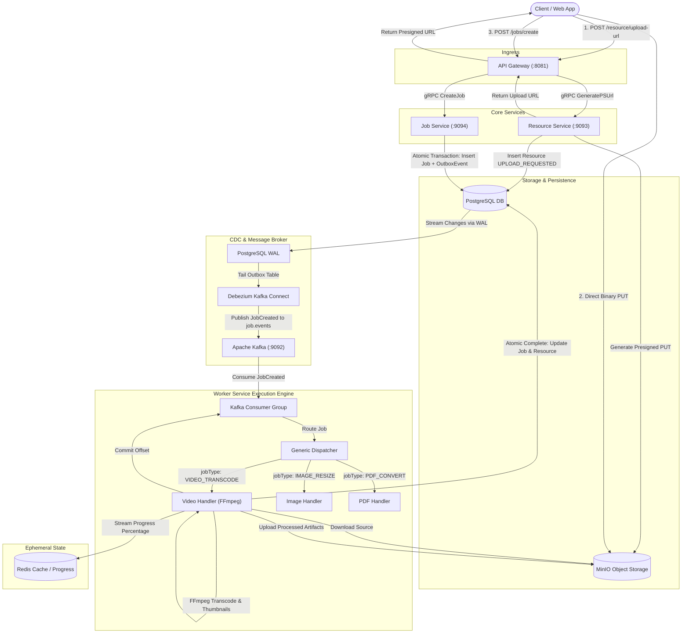

# Nimbus Project Context & Architecture Reference

## Project Vision

Project Name: **Nimbus**

Nimbus is **NOT** a video transcoding application.

Nimbus is a **Cloud-Native Distributed Job Execution Platform** whose first implemented workload is **video transcoding**.

The platform is designed so that future workloads (image processing, AI inference, document conversion, CSV ETL, etc.) can be added without changing the core execution engine.

The platform layer remains completely independent from any specific workload.

```text
Resource (Data) → Job (Instruction) → Outbox → Debezium → Kafka → Worker (Platform Engine) → Handler (Workload) → Result
```

---

# Core Philosophy

Separate the project into two logical layers.

## Platform Layer

Responsible for:

* Job creation & validation
* Scheduling & Consumer Group distribution
* Queueing
* Execution orchestration
* Retry & backoff logic
* Cancellation
* Progress tracking
* Worker heartbeats & leases
* Worker management
* Horizontal scaling
* Event publishing (Transactional Outbox)
* Observability & metrics

This layer knows **nothing** about videos or FFmpeg.

---

## Workload Layer

Current workload: **Video Transcoding**

Contains:

* FFmpeg execution
* FFprobe metadata parsing
* Multi-bitrate transcoding (e.g. 720p, 1080p)
* Thumbnail generation
* Preview generation

If tomorrow video processing is removed, the Platform Layer should continue functioning without modification.

This separation is the primary architectural goal.

---

# 1. Fundamental Concept: Resource ≠ Job

A critical architectural distinction in Nimbus:

* **Resource:** The data/file existing in storage (e.g., `video.mp4`, `image.png`, `report.pdf`, `dataset.csv`).
* **Job:** An explicit instruction to perform some operation on a resource (e.g., `transcode video.mp4`, `resize image.png`, `convert report.pdf`).

```text
Resource (e.g. sample.mp4)
   │
   ├── Job 1: Transcode 1080p (H.264)
   ├── Job 2: Generate Thumbnail (PNG)
   └── Job 3: Extract Audio (AAC)
```

### Uploading a Resource ≠ Creating a Job
* A resource can exist without a job.
* Uploading a file to MinIO does **not** automatically trigger processing.
* The client explicitly requests job creation via `POST /jobs/create` specifying what operation to perform.
* If a client uploads a file to MinIO (200 OK) but closes their browser before calling `POST /jobs/create`, this is an **orphaned resource**, not a failed Nimbus job.

---

# The 4-Core Service Architecture

Nimbus is composed of four primary microservices (with an optional fifth for search), designed to strictly separate responsibilities:

| Service | Protocol / Ports | Responsibility | Non-Goals |
|---|---|---|---|
| **API Gateway** | HTTP `:8081`, WebSocket | Routes external client REST requests, handles CORS, validates request syntax, and streams real-time execution progress via WebSockets. | Does not talk directly to databases or run workloads. Proxies to backend services via gRPC. |
| **Resource Service** | gRPC `:9093` | Manages file uploads, generates Presigned URLs, verifies storage objects, manages `resources` metadata table. | Knows about resources, **not** jobs. Does not execute workloads or touch Kafka. |
| **Job Service** | gRPC `:9094` | Validates job requests, manages job state lifecycle, and atomically writes `Job` and `OutboxEvent` records. | Knows about jobs, **not** execution details. Does not know how FFmpeg works. |
| **Worker Service** | Kafka Consumer | Event-driven execution engine. Consumes from Kafka, generic dispatcher routes jobs to workload handlers (`video`, `image`, etc.), updates DB progress, and writes real-time progress to Redis. | Has no HTTP API. Does not accept direct client ingress. |
| **Search Service (Optional)** | gRPC / HTTP | Read-only queries, filtering, and aggregation. | Future read-model optimization. |

*Note: The "Scheduler" is handled natively by Kafka Consumer Groups. The "Dispatcher" is an internal Go package inside the Worker Service.*

---

# Master Architecture Diagram



---

# Current Project Progress

Completed:

* Kubernetes local development environment using Tilt
* PostgreSQL StatefulSet (configured with `wal_level=logical`)
* MinIO StatefulSet
* Apache Kafka (KRaft mode) & Debezium Kafka Connect deployments
* API Gateway HTTP server with CORS middleware
* gRPC communication between Gateway, Resource Service, and Job Service
* Resource Service with Presigned URL generation and metadata persistence
* Job Service with Atomic Transactional Outbox write
* GORM integration with UUID-based models
* Direct upload architecture (Presigned PUT URLs)
* Production-style Clean Architecture & Repository pattern
* Shared environment configuration package

Current estimated completion: Approximately **35-40%**  
The ingestion and metadata staging foundation is implemented; the execution engine (Worker, Dispatcher, Handlers, Debezium connector registration, Redis progress) is the next major phase.

---

# Upload Flow (Direct-to-Storage)

Upload uses Presigned URLs so the backend never streams binary media bytes:

```text
Client
  ↓
POST /resource/upload-url
  ↓
API Gateway
  ↓
Resource Service (gRPC GeneratePSUrl)
  ↓
Generate UUID
  ↓
Insert Resource Metadata (UPLOAD_REQUESTED)
  ↓
Generate MinIO Presigned PUT URL
  ↓
Return Upload URL to Client
  ↓
Client uploads directly to MinIO (PUT)
  ↓
HTTP 200 from MinIO
  ↓
POST /jobs/create
```

Large files never pass through Go services, avoiding memory exhaustion and network bottlenecks.

---

# Why Upload and Job Creation are Separate

Upload success does not automatically imply processing. The client explicitly decides when processing begins.

```text
Upload
  ↓
Success (200 OK)
  ↓
POST /jobs/create
```

This allows:

* Explicit workload specification (e.g. resolution, bitrate, format)
* Validation & authorization checks
* Duplicate detection
* Storage object existence verification (`HEAD` check)
* Future tenant quota enforcement

---

# Job Creation & Transactional Outbox

`POST /jobs/create` is the entry point where platform processing begins.

Responsibilities:

* Verify object exists in MinIO (via Resource Service)
* Update Resource status to `UPLOADED`
* Create Job record (`QUEUED`)
* Create Outbox event (`JobCreated`)
* Commit database transaction

After commit:
* Debezium captures the outbox row from PostgreSQL WAL.
* Debezium publishes the event to Kafka (`job.events`).
* Workers consume the event and begin processing.

---

# Current API Structure

### 1. Ingestion Endpoints
* **Request Upload URL:**
  ```http
  POST /resource/upload-url
  ```
  Payload:
  ```json
  {
    "fileName": "video.mp4",
    "contentType": "video/mp4",
    "fileSize": 104857600,
    "resourceType": "VIDEO"
  }
  ```

### 2. Job Lifecycle Endpoints
* **Create Job:**
  ```http
  POST /jobs/create
  ```
  Payload:
  ```json
  {
    "resourceID": "4f2c038c-c5fd-410a-ba92-d602167d4aa3",
    "jobType": "VIDEO_TRANSCODE",
    "parameters": {
      "resolution": "1080p",
      "codec": "libx264"
    }
  }
  ```

### 3. Query & Download Endpoints (Upcoming)
* **Get Job Status & Progress:**
  ```http
  GET /jobs/{id}
  ```
* **Cancel Job:**
  ```http
  POST /jobs/{id}/cancel
  ```
* **Download Resource:**
  ```http
  GET /resources/{id}/download
  ```

---

# PostgreSQL is the Source of Truth

Every important state change is written to PostgreSQL first:

* `UPLOAD_REQUESTED` (Resource initialized)
* `UPLOADED` (Resource binary confirmed)
* `QUEUED` (Job created)
* `RUNNING` (Worker picked up job)
* `COMPLETED` (Job output processed)
* `FAILED` (Job exhausted retries)
* `CANCELLED` (Job explicitly cancelled)

**Kafka is never considered the source of truth.**

---

# PostgreSQL vs. Redis: The Mental Model

| Database | Role | Guiding Question | Examples |
|---|---|---|---|
| **PostgreSQL** | Durable Business Data | *"What MUST survive a server/pod restart?"* | Job status, Resource metadata, Outbox events, Job history, Retry counts. |
| **Redis** | Ephemeral Runtime State | *"What is high-frequency or temporary?"* | Real-time progress (`job:123:progress -> 73%`), Worker heartbeats (`worker:abc:heartbeat`), Worker presence TTLs, temporary leases. |

*Redis never stores durable business data.* If a worker heartbeat in Redis expires, the platform considers that worker dead and reclaims the job.

---

# Kafka Usage

Kafka is strictly responsible for **asynchronous work distribution**:

* Decouples ingestion (Job Service) from execution (Workers).
* Provides consumer groups for automatic horizontal scaling and partition failover.
* Uses domain-oriented topics such as `job.events` (containing `JobCreated`, `JobCompleted`, `JobFailed`, `JobCancelled`, `JobRetried`).

---

# CDC Decision: Outbox Pattern vs. Dual-Writes

### The Dual-Write Problem
If Job Service saves to PostgreSQL and then directly publishes to Kafka:
```text
1. INSERT Job into DB  --> SUCCESS ✅
2. Publish to Kafka     --> CRASH 💥
```
The job exists in the database but Kafka never receives the event, leaving the job permanently orphaned.

### The Solution: Transactional Outbox + Debezium
The application only writes to PostgreSQL within a single atomic transaction:
```sql
BEGIN;
  INSERT INTO jobs (id, resource_id, status, ...) VALUES (...);
  INSERT INTO outbox_events (id, aggregate_type, aggregate_id, event_type, payload, ...) VALUES (...);
COMMIT;
```

Either both records are committed, or neither is. Debezium reads the PostgreSQL WAL (Write-Ahead Log) and streams the outbox events to Kafka safely.

---

# Why CDC Watches the Outbox Table (Not All Tables)

**Question:** *"If we use CDC, why not let Debezium tail every update on the `jobs` table directly?"*

**Answer:**  
We do **not** want high-frequency internal state changes (e.g. progress 10% → 20% → 30%) to flood Kafka with hundreds of unformatted database change events. 

The Outbox acts as an explicit boundary: the application explicitly writes meaningful **business events** (`JobCreated`, `JobCompleted`, `JobFailed`, `JobCancelled`) with structured payloads that workers care about.

---

# At-Least-Once Delivery & Idempotent Workers

Debezium and Kafka provide **at-least-once delivery**. If Debezium publishes an event and restarts before updating its Kafka Connect offset, or if a worker crashes before committing its consumer offset, the same event can be delivered more than once:

```text
JobCreated
JobCreated (duplicate delivery)
```

**Rule:** We never assume the network provides exactly-once delivery. The Worker is designed to be **idempotent**:
* Before processing, the worker verifies whether the job is already `RUNNING` or `COMPLETED`.
* It uses conditional database updates or distributed execution leases to ensure duplicate messages are safely ignored.

---

# Discussion: Why Kafka Does NOT Sit Before PostgreSQL

**Question:** *"Should Kafka sit before PostgreSQL to absorb traffic bursts?"*

```text
API → Kafka → Consumer → PostgreSQL  (Kafka-First Ingestion)
```

**Decision:** **NO.**

**Reason:**  
Nimbus is a transactional platform. When a client calls `POST /jobs/create`, it expects a `201 Created` response guaranteeing that the job exists and has been securely persisted.

Kafka-first ingestion is suited for high-volume analytics, logs, IoT telemetry, and clickstreams where individual message loss or eventual consistency is acceptable.

### Handling Database Bursts
Instead of putting Kafka before PostgreSQL, Nimbus handles traffic spikes via:
* Database Connection Pooling (PgBouncer)
* Kubernetes Horizontal Pod Autoscaling (HPA)
* Ingress Rate Limiting & Backpressure
* Read Replicas (future)
* PostgreSQL performance tuning

---

# Job Processing Architecture & Scheduler Decision

### Why No Independent "Scheduler" or "JobConsumer" Service?
Kafka Consumer Groups already natively provide:
* Load balancing across workers
* Partition rebalancing and failover
* Worker node discovery

Workers consume directly from Kafka consumer groups.

### Future Scheduler Service
An independent Scheduler service will only be introduced if Nimbus requires complex scheduling features such as:
* Priority scheduling
* Multi-tenant fair queuing & quotas
* Worker capability matching (e.g., GPU vs. CPU nodes)
* Delayed or Cron job execution

Until then, keeping scheduling inside Kafka consumer groups eliminates unnecessary network hops and operational complexity.

---

# Worker & Dispatcher Architecture

### The Worker is Generic
The Worker is **not** a "Video Worker"; it is a generic job execution engine:

```text
services/worker-service/
├── cmd/
│   └── main.go
└── internal/
    ├── platform/                 # Generic Execution Engine
    │   ├── consumer/             # Kafka Consumer Group reader
    │   ├── dispatcher/           # Routes job.JobType -> Workload Handler
    │   ├── heartbeat/            # Worker presence & Redis TTL
    │   ├── progress/             # Redis progress publisher
    │   └── retry/                # Exponential backoff & retry state
    └── handlers/                 # Isolated Workload Handlers
        ├── video/                # Video Transcoding (FFmpeg, FFprobe, Thumbnails)
        ├── image/                # Image Processing (Resize, Compression)
        ├── pdf/                  # PDF Operations (Merge, Convert)
        └── ai/                   # AI/ML Inference Workloads
```

### Generic Dispatcher Pattern
```go
type JobHandler interface {
    Execute(ctx context.Context, job *domain.Job) (*domain.ExecutionResult, error)
}

// Dispatcher dynamically routes jobs to the registered handler based on JobType
func (d *Dispatcher) Dispatch(ctx context.Context, job *domain.Job) error {
    handler, exists := d.handlers[job.JobType]
    if !exists {
        return fmt.Errorf("unsupported job type: %s", job.JobType)
    }
    return handler.Execute(ctx, job)
}
```

---

# Event Payload Philosophy

Workers receive complete job information in the Kafka event payload:
* `JobID`
* `ResourceID`
* `JobType`
* `Parameters` (JSON payload)
* `RetryCount` / `MaxRetries`

Workers do not need to immediately query PostgreSQL just to understand what work to perform.

---

# Worker Execution Lifecycle & Offset Commits

```text
Receive Kafka Message
  ↓
Update DB Status = RUNNING (set StartedAt)
  ↓
Download Source File from MinIO
  ↓
Execute Workload Handler (FFprobe → FFmpeg → Thumbnails)
  ↓ [Stream progress 0-100% to Redis]
Upload Output Artifacts to MinIO
  ↓
Update PostgreSQL (Job = COMPLETED, Insert Output Resource, Insert JobCompleted Outbox Event)
  ↓
Commit Database Transaction
  ↓
Kafka Offset Commit (ACK)
```

**Critical Rule:** The Kafka consumer offset is **only committed after** the database transaction succeeds. If the worker crashes mid-task, Kafka redelivers the message to another worker.

---

# Failure & Recovery Model

Every step in the architecture is designed around crash recovery:

| Failure Scenario | Recovery Behavior |
|---|---|
| **Client crashes after upload before calling `POST /jobs`** | Unreferenced file in MinIO. Handled as an orphaned resource (swept by 24h retention policy). Not a failed job. |
| **Crash between DB write and Kafka publish** | Outbox pattern guarantees event is committed in PostgreSQL WAL; Debezium resumes from last confirmed LSN. |
| **Worker crashes during FFmpeg execution** | Redis heartbeat TTL expires. Kafka rebalances partition to another worker. New worker cleans scratch files and resumes. |
| **Worker encounters transient failure (e.g. MinIO I/O timeout)** | Worker increments `RetryCount`. If `RetryCount < MaxRetries`, status becomes `RETRYING` with exponential backoff. Otherwise `FAILED`. |
| **Duplicate Kafka event delivered** | Worker checks database state before execution to guarantee idempotent execution. |

---

# Clean Architecture Guidelines

Nimbus adheres strictly to Hexagonal (Ports & Adapters) Architecture.

## Domain Naming & Interfaces
The domain defines **what it needs (Ports)**, not **how it's implemented (Adapters)**:
* `ResourceRepository`: Manages CRUD operations for the Resource domain entity (implemented by PostgreSQL).
* `StorageProvider`: Manages blob storage operations like generating presigned URLs or checking object existence (implemented by MinIO/S3).
* `JobRepository`: Manages Job & Outbox persistence (implemented by PostgreSQL).

## Infrastructure Separation
Infrastructure adapters are isolated by technology inside `internal/infrastructure/`:
* `persistence/`: Adapters for relational databases (e.g., `postgres.go`).
* `storage/`: Adapters for object storage (e.g., `minio.go`, `s3.go`).
* `grpc_handler/`: Adapters for gRPC server endpoints.
* `events/`: Adapters for message brokers (Kafka/Debezium).

---

# Summary: The 7 Core Architectural Rules

If you return to this project after a month, remember these 7 pillars:

1. **Nimbus is a generic distributed job execution platform** — Video processing is only the first workload.
2. **Resource ≠ Job** — Resources are data; Jobs are execution instructions. Uploading does not equal running a job.
3. **PostgreSQL is the single durable source of truth** — State transitions are committed to DB before queueing.
4. **The Outbox Pattern eliminates dual-writes** — Database transactions atomically record jobs and outbox events.
5. **Debezium bridges PostgreSQL WAL to Kafka** — Asynchronous, resilient event streaming without application dual-writes.
6. **Kafka + Consumer Groups distribute work** — Native load-balancing, partition assignment, and worker horizontal scaling.
7. **Worker engine is generic; workloads live in handlers** — Clear separation between execution engine (`platform/`) and workload logic (`handlers/`).

---

# Target Project Structure (Future Reference)

Below is the target directory layout for Nimbus as the platform expands into production:

```text
Nimbus/
│
├── Makefile
├── README.md
├── Tiltfile
├── go.mod
├── go.sum
│
├── docs/
│   ├── architecture.md
│   ├── architectural_decisions.md
│   ├── schemas.md
│   └── sequences/
│       ├── upload.md
│       ├── job_creation.md
│       ├── job_execution.md
│       └── failure_recovery.md
│
├── proto/
│   ├── resource.proto
│   ├── job.proto
│   └── worker.proto
│
├── services/
│   │
│   ├── api-gateway/
│   │   ├── cmd/
│   │   │   └── main.go
│   │   │
│   │   └── internal/
│   │       ├── http/
│   │       ├── grpc/
│   │       ├── middleware/
│   │       ├── websocket/
│   │       └── bootstrap/
│   │
│   │
│   ├── resource-service/
│   │   ├── cmd/
│   │   │   └── main.go
│   │   │
│   │   └── internal/
│   │       ├── domain/
│   │       │   ├── resource.go
│   │       │   ├── repository.go
│   │       │   └── storage.go
│   │       │
│   │       ├── service/
│   │       │   └── resource_service.go
│   │       │
│   │       ├── infrastructure/
│   │       │   ├── persistence/
│   │       │   │   └── postgres.go
│   │       │   │
│   │       │   ├── storage/
│   │       │   │   └── minio.go
│   │       │   │
│   │       │   ├── grpc/
│   │       │   │   └── handler.go
│   │       │   │
│   │       │   └── events/
│   │       │
│   │       └── bootstrap/
│   │           └── bootstrap.go
│   │
│   │
│   ├── job-service/
│   │   ├── cmd/
│   │   │   └── main.go
│   │   │
│   │   └── internal/
│   │       ├── domain/
│   │       │   ├── job.go
│   │       │   ├── repository.go
│   │       │   ├── publisher.go
│   │       │   └── state_machine.go
│   │       │
│   │       ├── service/
│   │       │   ├── create_job.go
│   │       │   ├── retry_job.go
│   │       │   ├── cancel_job.go
│   │       │   └── update_status.go
│   │       │
│   │       ├── infrastructure/
│   │       │   ├── persistence/
│   │       │   │   └── postgres.go
│   │       │   │
│   │       │   ├── messaging/
│   │       │   │   └── outbox.go
│   │       │   │
│   │       │   ├── grpc/
│   │       │   │   └── handler.go
│   │       │   │
│   │       │   └── events/
│   │       │
│   │       └── bootstrap/
│   │           └── bootstrap.go
│   │
│   │
│   └── worker/
│       ├── cmd/
│       │   └── main.go
│       │
│       └── internal/
│           ├── consumer/
│           │   └── kafka_consumer.go
│           │
│           ├── dispatcher/
│           │   └── dispatcher.go
│           │
│           ├── handlers/
│           │   │
│           │   ├── video/
│           │   │   ├── handler.go
│           │   │   ├── ffmpeg.go
│           │   │   ├── thumbnail.go
│           │   │   └── metadata.go
│           │   │
│           │   ├── image/
│           │   │   └── handler.go
│           │   │
│           │   ├── pdf/
│           │   │   └── handler.go
│           │   │
│           │   └── ai/
│           │       └── handler.go
│           │
│           ├── progress/
│           │   └── redis.go
│           │
│           ├── repository/
│           │   └── postgres.go
│           │
│           ├── storage/
│           │   └── minio.go
│           │
│           ├── messaging/
│           │   └── publisher.go
│           │
│           └── bootstrap/
│               └── bootstrap.go
│
│
├── shared/
│   ├── config/
│   │   └── env.go
│   │
│   ├── logger/
│   │
│   ├── messaging/
│   │   └── kafka.go
│   │
│   ├── database/
│   │   └── postgres.go
│   │
│   ├── storage/
│   │   └── minio.go
│   │
│   ├── errors/
│   │
│   ├── observability/
│   │
│   └── proto/
│       ├── resource/
│       ├── job/
│       └── worker/
│
│
└── infra/
    │
    ├── development/
    │   ├── docker/
    │   └── k8s/
    │       ├── api-gateway/
    │       ├── resource-service/
    │       ├── job-service/
    │       ├── worker/
    │       ├── postgres/
    │       ├── minio/
    │       ├── redis/
    │       ├── kafka/
    │       └── debezium/
    │
    └── production/
        ├── docker/
        └── k8s/
```

### The Core Architectural Anchor

Don't get distracted by every folder. The core architecture is simply this:

```text
                         Nimbus
                            │
              ┌─────────────┴─────────────┐
              │                           │
        Resource Service             Job Service
              │                           │
            MinIO                    PostgreSQL
                                          │
                                        Outbox
                                          │
                                       Debezium
                                          │
                                        Kafka
                                          │
                                   Worker Service
                                          │
                                     Dispatcher
                                          │
                    ┌─────────────────────┼───────────────────┐
                    │                     │                   │
                    ▼                     ▼                   ▼
              Video Handler        Image Handler        PDF Handler
```

---

# Overall Project Goal

By completion, Nimbus should resemble a production-grade backend infrastructure platform rather than a simple converter script.

**Desired Project Pitch:**
> *"Nimbus is a cloud-native distributed job execution platform that reliably executes long-running asynchronous workloads. The platform provides scheduling, retries, worker orchestration, progress tracking, observability, and fault recovery. Video transcoding is implemented as the first workload to demonstrate the platform's capabilities."*
