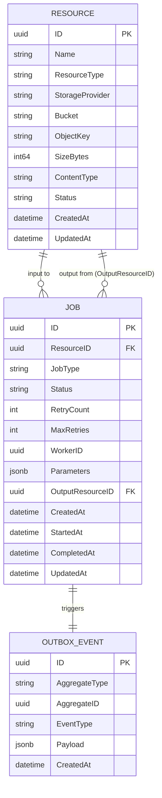

# Nimbus Schemas & Data Models Reference

This document serves as the single source of truth for all schemas, entities, data models, and wire-level contracts created across the Nimbus platform. It includes parameter-by-parameter descriptions, constraints, data types, and lifecycle roles.

---

## Table of Contents
1. [Overview of Schema Layers](#1-overview-of-schema-layers)
2. [Database Entities (PostgreSQL / GORM)](#2-database-entities-postgresql--gorm)
   - [2.1 Resource Entity (`resources` table)](#21-resource-entity-resources-table)
   - [2.2 Job Entity (`jobs` table)](#22-job-entity-jobs-table)
   - [2.3 Outbox Event Entity (`outbox_events` table)](#23-outbox-event-entity-outbox_events-table)
3. [gRPC / Protocol Buffer Schemas](#3-grpc--protocol-buffer-schemas)
   - [3.1 Resource Service (`resource.proto`)](#31-resource-service-resourceproto)
   - [3.2 Job Service (`job.proto`)](#32-job-service-jobproto)
4. [HTTP / REST API Schemas (API Gateway DTOs)](#4-http--rest-api-schemas-api-gateway-dtos)
   - [4.1 Upload URL DTOs](#41-upload-url-dtos)
   - [4.2 Job Creation DTOs](#42-job-creation-dtos)
5. [Kafka Event & Outbox Payload Schemas](#5-kafka-event--outbox-payload-schemas)
   - [5.1 `JobCreated` Outbox Payload](#51-jobcreated-outbox-payload)
6. [Enums & Value Sets](#6-enums--value-sets)
7. [Cross-Entity Data Flow & Schema Relationships](#7-cross-entity-data-flow--schema-relationships)

---

## 1. Overview of Schema Layers

Nimbus strictly decouples contracts by boundary layer:

```
[ External Client ]
        │  (HTTP / JSON REST DTOs)
        ▼
[ API Gateway ]
        │  (gRPC / Protobuf Binaries)
        ▼
[ Core Services (Resource, Job) ]
        │  (GORM / SQL Relational Schema)
        ▼
[ PostgreSQL / MinIO Storage ]
        │  (CDC / Outbox Event JSON Payload)
        ▼
[ Debezium / Kafka / Workers ]
```

---

## 2. Database Entities (PostgreSQL / GORM)

### 2.1 Resource Entity (`resources` table)
- **Service Owner:** `Resource Service`
- **Source File:** `services/resource-service/internal/domain/resource.go`
- **Purpose:** Tracks the identity, physical location, size, and upload state of any file/binary stored in object storage (MinIO/S3).

```go
type Resource struct {
    ID              uuid.UUID      `gorm:"type:uuid;primaryKey"`
    Name            string         `gorm:"type:varchar(255);not null"`
    ResourceType    ResourceType   `gorm:"type:varchar(50);not null"`
    StorageProvider StorageType    `gorm:"type:varchar(50);not null"`
    Bucket          string         `gorm:"type:varchar(100);not null"`
    ObjectKey       string         `gorm:"type:varchar(500);not null"`
    SizeBytes       int64          `gorm:"not null"`
    ContentType     string         `gorm:"type:varchar(100);not null"`
    Status          ResourceStatus `gorm:"type:varchar(50);not null"`
    CreatedAt       time.Time
    UpdatedAt       time.Time
}
```

#### Parameter Breakdown

| Parameter | Type | Nullable / Constraints | Description & Working |
|---|---|---|---|
| `ID` | `uuid.UUID` | `PK`, Non-null | Unique identifier for the resource. Generated when presigned URL is requested. Used across all services to reference the input or output file. |
| `Name` | `string` | Non-null | The original file name provided by the user (e.g. `raw_video_sample.mp4` or `input.png`). Preserved for user presentation. |
| `ResourceType` | `ResourceType` | Non-null | Generic workload domain classification (`VIDEO`, `IMAGE`, `DOCUMENT`). Enables the platform to support diverse asset types. |
| `StorageProvider` | `StorageType` | Non-null | Indicates where the binary is physically stored (`MINIO`, `S3`). Supports future multi-cloud/hybrid setups. |
| `Bucket` | `string` | Non-null | The target object storage bucket name (e.g. `resource-bucket`). |
| `ObjectKey` | `string` | Non-null | The unique path/key in MinIO/S3 (e.g. `resource/original/<uuid>.mp4` or `resource/processed/<uuid>/1080p.mp4`). Prevents collision between uploaded files with the same original name. |
| `SizeBytes` | `int64` | Non-null | Size of the asset in bytes. Validated against storage quotas or limits. |
| `ContentType` | `string` | Non-null | MIME type of the resource (e.g. `video/mp4`, `image/jpeg`, `application/pdf`). Used by MinIO headers and workload parsers. |
| `Status` | `ResourceStatus` | Non-null | Current lifecycle stage of the physical asset (`UPLOAD_REQUESTED`, `UPLOADED`, `PROCESSING`, `COMPLETED`, `FAILED`). |
| `CreatedAt` | `time.Time` | Non-null | Timestamp when the upload request record was initialized. |
| `UpdatedAt` | `time.Time` | Non-null | Timestamp when the resource metadata was last updated. |

---

### 2.2 Job Entity (`jobs` table)
- **Service Owner:** `Job Service`
- **Source File:** `services/job-service/internal/domain/job.go`
- **Purpose:** Represents an asynchronous execution unit scheduled against a specific input resource.

```go
type Job struct {
    ID               uuid.UUID      `gorm:"type:uuid;primaryKey"`
    ResourceID       *uuid.UUID     `gorm:"type:uuid;index"`
    JobType          JobType        `gorm:"type:varchar(50);not null"`
    Status           JobStatus      `gorm:"type:varchar(50);not null"`
    RetryCount       int            `gorm:"default:0"`
    MaxRetries       int            `gorm:"default:3"`
    WorkerID         *uuid.UUID     `gorm:"type:uuid"`
    Parameters       datatypes.JSON `gorm:"type:jsonb"`
    OutputResourceID *uuid.UUID     `gorm:"type:uuid"`
    ErrorMessage     *string        `gorm:"type:text"`
    CreatedAt        time.Time
    StartedAt        *time.Time
    CompletedAt      *time.Time
    UpdatedAt        time.Time
}
```

#### Parameter Breakdown

| Parameter | Type | Nullable / Constraints | Description & Working |
|---|---|---|---|
| `ID` | `uuid.UUID` | `PK`, Non-null | Unique identifier of the job instance. |
| `ResourceID` | `*uuid.UUID` | `Index`, Nullable | Optional foreign reference pointing to the input `Resource.ID` in the `resources` table. Connects the job to an input file when binary storage is needed. `nil` for resource-less jobs. |
| `JobType` | `JobType` | Non-null | Identifier of the operation to perform (`VIDEO_TRANSCODE`, `IMAGE_RESIZE`, etc.). Used by the Worker Dispatcher to route to the appropriate workload handler. |
| `Status` | `JobStatus` | Non-null | State machine status of execution (`QUEUED`, `RUNNING`, `COMPLETED`, `FAILED`, `CANCELLED`, `RETRYING`). |
| `RetryCount` | `int` | Non-null (Default: `0`) | Number of execution attempts completed so far after failures. |
| `MaxRetries` | `int` | Non-null (Default: `3`) | Maximum number of retry attempts before the job transitions permanently to `FAILED`. |
| `WorkerID` | `*uuid.UUID` | Nullable | UUID of the active worker executing the job. Set when a worker acquires the job lease. `nil` when queued. |
| `Parameters` | `datatypes.JSON` | Nullable (`JSONB`) | Free-form, workload-specific dynamic JSON configuration (e.g. `{"resolution": "1080p", "codec": "h264", "bitrate": "4000k"}`). Gives infinite flexibility to future workloads without altering the DB schema. |
| `OutputResourceID`| `*uuid.UUID` | Nullable | UUID referencing the newly generated output `Resource` record once processing succeeds. `nil` until completion or if no resource was produced. |
| `ErrorMessage` | `*string` | Nullable (`TEXT`) | Stores the failure reason or error message if execution fails. Enables client/API error visibility. |
| `CreatedAt` | `time.Time` | Non-null | Timestamp when the job was queued. |
| `StartedAt` | `*time.Time` | Nullable | Timestamp when a worker picked up the job and set it to `RUNNING`. |
| `CompletedAt` | `*time.Time` | Nullable | Timestamp when execution finalized (succeeded, failed, or was cancelled). |
| `UpdatedAt` | `time.Time` | Non-null | Timestamp of the last state change. |

---

### 2.3 Outbox Event Entity (`outbox_events` table)
- **Service Owner:** `Job Service`
- **Source File:** `services/job-service/internal/domain/job.go`
- **Purpose:** Implements the **Transactional Outbox Pattern**. Written atomically in the same database transaction as `jobs` to guarantee reliable CDC delivery to Kafka via Debezium.

```go
type OutboxEvent struct {
    ID            uuid.UUID      `gorm:"type:uuid;primaryKey"`
    AggregateType string         `gorm:"type:varchar(50);not null"`
    AggregateID   uuid.UUID      `gorm:"type:uuid;not null"`
    EventType     EventType      `gorm:"type:varchar(50);not null"`
    Payload       datatypes.JSON `gorm:"type:jsonb;not null"`
    CreatedAt     time.Time
}
```

#### Parameter Breakdown

| Parameter | Type | Nullable / Constraints | Description & Working |
|---|---|---|---|
| `ID` | `uuid.UUID` | `PK`, Non-null | Unique ID of the outbox event record. |
| `AggregateType` | `string` | Non-null | The entity/domain aggregate name producing this event (e.g. `"Job"`, `"Resource"`). Enables event routing in Kafka. |
| `AggregateID` | `uuid.UUID` | Non-null | The UUID of the aggregate instance (e.g. `Job.ID`). Used as the partition key in Kafka to guarantee ordered processing per aggregate. |
| `EventType` | `EventType` | Non-null | The specific event name (`JobCreated`, `JobCompleted`, `JobFailed`, `JobCancelled`). |
| `Payload` | `datatypes.JSON` | Non-null (`JSONB`) | Full JSON document containing all data the consumer/worker needs so it doesn't need an immediate query back to Postgres. |
| `CreatedAt` | `time.Time` | Non-null | Timestamp when the event was committed to the outbox table. |

---

## 3. gRPC / Protocol Buffer Schemas

### 3.1 Resource Service (`resource.proto`)
- **Package:** `resource`
- **Source File:** `proto/resource.proto`
- **Target Stubs:** `shared/proto/resource/resource.pb.go`

```protobuf
syntax = "proto3";

package resource;

option go_package = "shared/proto/resource;resource";

service ResourceService {
  rpc GeneratePSUrl(GeneratePSUrlRequest) returns (GeneratePSUrlResponse);
}

message GeneratePSUrlRequest {
  string FileName = 1;
  string ContentType = 2;
  int64 FileSize = 3;
  string ResourceType = 4;
}

message GeneratePSUrlResponse {
  string UploadUrl = 1;
  string ObjectKey = 2;
  int64 ExpiresIn = 3;
  string ResourceID = 4;
}
```

#### `GeneratePSUrlRequest` Parameters
| Field | Tag | Protobuf Type | Description |
|---|---|---|---|
| `FileName` | `1` | `string` | The original file name of the upload target (e.g. `sample.mp4`). |
| `ContentType` | `2` | `string` | MIME type (e.g. `video/mp4`). |
| `FileSize` | `3` | `int64` | File size in bytes. |
| `ResourceType` | `4` | `string` | Workload category (`VIDEO`, `IMAGE`, `DOCUMENT`). |

#### `GeneratePSUrlResponse` Parameters
| Field | Tag | Protobuf Type | Description |
|---|---|---|---|
| `UploadUrl` | `1` | `string` | Presigned MinIO PUT URL containing authentication tokens and headers. |
| `ObjectKey` | `2` | `string` | Unique storage path key assigned to the object in MinIO. |
| `ExpiresIn` | `3` | `int64` | URL expiration duration in seconds (default: 600s). |
| `ResourceID` | `4` | `string` | The generated UUID string identifying this resource in PostgreSQL. |

---

### 3.2 Job Service (`job.proto`)
- **Package:** `job`
- **Source File:** `proto/job.proto`
- **Target Stubs:** `shared/proto/job/job.pb.go`

```protobuf
syntax = "proto3";

package job;

option go_package = "shared/proto/job;job";

service JobService {
  rpc CreateJob (CreateJobRequest) returns (CreateJobResponse);
}

message CreateJobRequest {
  string ResourceID = 1;
  string JobType = 2;
  bytes Parameters = 3;
}

message CreateJobResponse {
  string JobId = 1;
  string Status = 2;
}
```

#### `CreateJobRequest` Parameters
| Field | Tag | Protobuf Type | Description |
|---|---|---|---|
| `ResourceID` | `1` | `string` | UUID string of the input resource that has been uploaded to storage. |
| `JobType` | `2` | `string` | Type of job requested (e.g. `VIDEO_TRANSCODE`). |
| `Parameters` | `3` | `bytes` | Raw JSON byte slice containing dynamic parameters for the handler. |

#### `CreateJobResponse` Parameters
| Field | Tag | Protobuf Type | Description |
|---|---|---|---|
| `JobId` | `1` | `string` | UUID string of the newly created Job record. |
| `Status` | `2` | `string` | Initial status string of the job (`QUEUED`). |

---

## 4. HTTP / REST API Schemas (API Gateway DTOs)

### 4.1 Upload URL DTOs
- **Source File:** `shared/types/types.go`
- **Endpoint:** `POST /resource/upload-url`

#### Request Payload (`UploadUrlRequest`)
```json
{
  "fileName": "demo_video.mp4",
  "contentType": "video/mp4",
  "fileSize": 104857600,
  "resourceType": "VIDEO"
}
```
- `fileName` (`string`, required): Name of the file.
- `contentType` (`string`, required): File MIME type.
- `fileSize` (`int64`, required): Total byte size.
- `resourceType` (`string`, required): `VIDEO` | `IMAGE` | `DOCUMENT`.

#### Response Payload (`UploadUrlResponse` - HTTP 201)
```json
{
  "uploadUrl": "http://localhost:9000/resource-bucket/resource/original/4f2...mp4?X-Amz-Algorithm=...",
  "objectKey": "resource/original/4f2c038c-c5fd-410a-ba92-d602167d4aa3.mp4",
  "expiresIn": 600,
  "resourceID": "4f2c038c-c5fd-410a-ba92-d602167d4aa3"
}
```

---

### 4.2 Job Creation DTOs
- **Source File:** `services/api-gateway/pkg/types/types.go`
- **Endpoint:** `POST /jobs/create`

#### Request Payload (`CreateJobRequest`)
```json
{
  "resourceID": "4f2c038c-c5fd-410a-ba92-d602167d4aa3",
  "jobType": "VIDEO_TRANSCODE",
  "parameters": {
    "resolution": "1080p",
    "generateThumbnail": true,
    "codec": "libx264"
  }
}
```
- `resourceID` (`string`, required): Valid UUID of uploaded resource.
- `jobType` (`string`, required): Target job workload type.
- `parameters` (`object`, required): Valid JSON object with workload instructions.

#### Response Payload (`CreateJobResponse` - HTTP 201)
```json
{
  "jobID": "9c1c4f52-87ad-4521-82ef-73a73c16260a",
  "status": "QUEUED"
}
```

---

## 5. Kafka Event & Outbox Payload Schemas

### 5.1 `JobCreated` Outbox Payload
- **Producer:** `Job Service` (`service.go`)
- **Transport:** PostgreSQL `outbox_events` -> Debezium CDC -> Kafka Topic (`job.events`)
- **Structure:** Contains the serialized state of the `Job` model at creation time:

```json
{
  "id": "9c1c4f52-87ad-4521-82ef-73a73c16260a",
  "resource_id": "4f2c038c-c5fd-410a-ba92-d602167d4aa3",
  "job_type": "VIDEO_TRANSCODE",
  "status": "QUEUED",
  "retry_count": 0,
  "max_retries": 3,
  "worker_id": null,
  "parameters": {
    "resolution": "1080p",
    "generateThumbnail": true,
    "codec": "libx264"
  },
  "output_resource_id": null,
  "created_at": "2026-08-22T11:15:00Z",
  "started_at": null,
  "completed_at": null,
  "updated_at": "2026-08-22T11:15:00Z"
}
```

---

## 6. Enums & Value Sets

### 6.1 `ResourceType`
```go
const (
    VideoResource    ResourceType = "VIDEO"
    ImageResource    ResourceType = "IMAGE"
    DocumentResource ResourceType = "DOCUMENT"
)
```

### 6.2 `ResourceStatus`
```go
const (
    UploadRequested ResourceStatus = "UPLOAD_REQUESTED" // Presigned URL issued; waiting for client PUT
    Uploaded        ResourceStatus = "UPLOADED"         // Binary verified in storage
    Processing      ResourceStatus = "PROCESSING"       // Worker is transforming this resource
    Completed       ResourceStatus = "COMPLETED"        // Resource is ready for consumption
    Failed          ResourceStatus = "FAILED"           // Resource validation or processing failed
)
```

### 6.3 `StorageType`
```go
const (
    MinIO StorageType = "MINIO"
    S3    StorageType = "S3"
)
```

### 6.4 `JobType`
```go
const (
    VideoTranscode JobType = "VIDEO_TRANSCODE"
    ImageResize    JobType = "IMAGE_RESIZE"
)
```

### 6.5 `JobStatus`
```go
const (
    JobQueued    JobStatus = "QUEUED"    // Job written to Postgres and Outbox
    JobRunning   JobStatus = "RUNNING"   // Worker has acquired job and is actively executing
    JobCompleted JobStatus = "COMPLETED" // Workload finished successfully; outputs uploaded
    JobFailed    JobStatus = "FAILED"    // Execution exhausted retries and failed
    JobCancelled JobStatus = "CANCELLED" // Cancelled by user or platform
    JobRetrying  JobStatus = "RETRYING"  // Transient error occurred; scheduled for next attempt
)
```

### 6.6 `EventType` (Outbox Events)
```go
const (
    EventJobCreated   EventType = "JobCreated"
    EventJobCompleted EventType = "JobCompleted"
    EventJobFailed    EventType = "JobFailed"
)
```

---

## 7. Cross-Entity Data Flow & Schema Relationships


