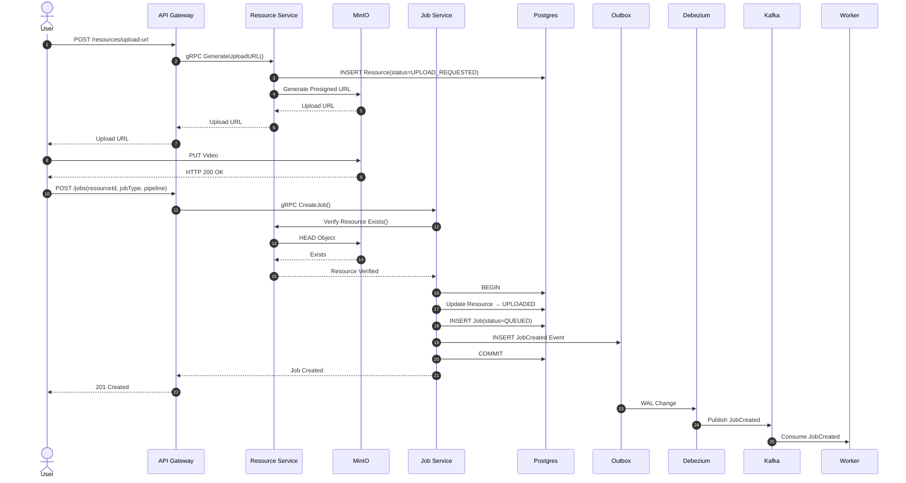
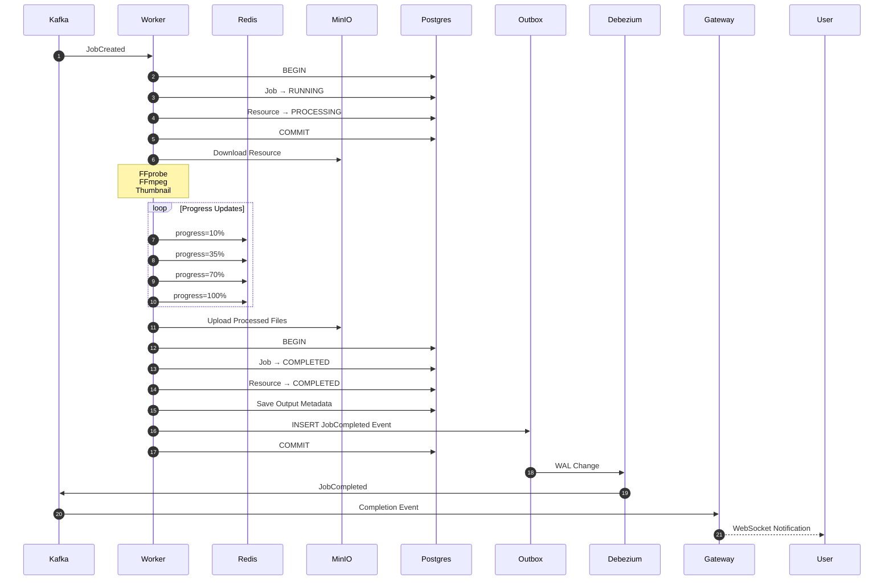
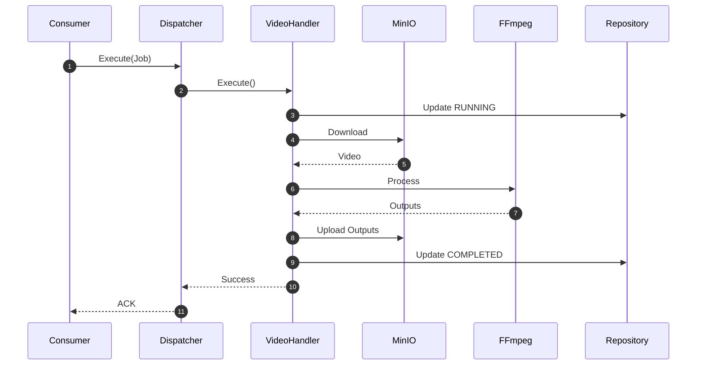

# Nimbus Sequence Diagrams

These sequence diagrams represent the "source of truth" for the Nimbus Job Execution Platform architecture.

## Sequence 1 — Upload & Job Creation

## Sequence 2 — Worker Execution

## Sequence 3 — Internal Worker Flow

